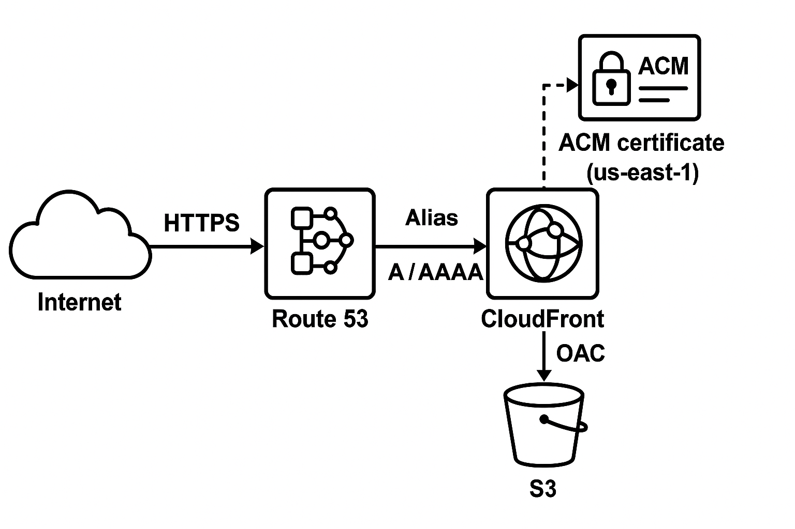

# CloudResumeChallenge

# Vasiliy Rodin Devops Resume Challenge: 
## Following the work steps from:  
## https://cloudresumechallenge.dev/docs/the-challenge/aws/ 

This project has exposed me to modern cicd practices. Creating my own pipelines for code deployment, deploying a static website through automation.  

Steps Completed: 
    1. Get Cloud Certified(Still working on it) 
    2. HTML- create an html website. 
    3. Add css to the website 
    4. Host the website in s3(did it with terraform and github actions to update the bucket with my site files) 
    5. Enable https using cloud front(first manually then with terraform). 
    6. Create a terraform deployments for Cloudfront, Route53, S3 bucket.  
    7. Create route 53 for vasiliyrodin.com to point to my cloud front deployment that points to the s3 bucket. 
    8. Create git hub actions work flow to always update my s3 bucket with the latest code from the repo for html css and js. 
    9. Add a page view tracker. Currently the data is stored locally in the browser but will set up dynamodb for future storage. 

### Notes from my deployments
HTTPS Through cloudfront. 
    I have to terminate public access to the s3 bucket. 
    Only allow cloudfront to access the bucket. 
    Run all traffic through cloudfront. 

What I learned deploying this with terraform. 
    It is not easy. So many configs to worry about that don't show up in the documentation. 
    You can create the origin access (OAC) first. And assign it later (When creating this in the console you can create it on the spot and assign it) 

Adding a route 53 hosted zone was not difficult. 
Creating a hosted zone with my vasiliyrodin.com url I was able to view tf output and add my ns servers to my domain provider. Now I need hook my cloudfront to use that URL. 
Creating a certificate for my dns. 
I need to first create a dns certificate in tf it is aws_acm_certificate. 
Validate the certificate with route 53. By assigning it to your dns record. 
Attach the certificate to your cloudfront under viewer certificate and the alternate domain name(vasiliyrodin.com) 
Create an A record in the route53 pointing to your cloud front distribution. 

This is my current setup.
